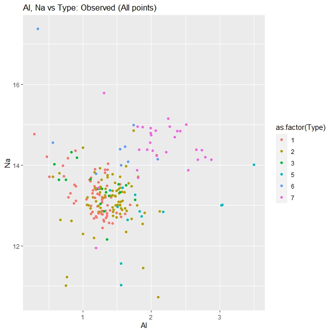

# KNN with K-fold cross validation in R
The k-nearest neighbors algorithm is a supervised learning algorithm, commonly used for classification. Its based on the idea that similar points can be found near one another. 
 


## The data

* [Kaggle glass dataset](https://www.kaggle.com/datasets/uciml/glass)
* Rows 1-9 are predictive
* Row 10 is the category: 1-7
* [Click here to view the detailed data report](https://chardur.github.io/knn-example-R/report.html)

## Model

You can view the code for the model in [knn-example.R](https://github.com/chardur/knn-example-R/blob/main/knn-example.R) in this repo. 


* The data is shuffled to minimize random effects and effects from sorted data
* The data is then split into 2 datasets: Training(train the model), Test(estimate performance of the model)
* It is important to scale the data ! I used the caret preProcess(center, scale) function in this model.
* Try K values from 3-15 to determine best model
* 10 fold cross validation is used to measure effectiveness of model at each K value


To find the best model, k-nearest neighbors values from 3 to 15 is tested. 
10 Fold cross validation is used to determine the effectiveness at each K value.
Once a model is chosen, it is then tested with the test data to estimate the final performance.
This dataset is small with only 215 observations. Due to this, 90% of the data is used for training and 10% for testing.

## Analysis

[Click here to view the data analysis report](https://chardur.github.io/knn-example-R/report.html)

Graphing the relationship between k value and accuracy I found that k=3 provided the best results at 68.39% accuracy with the training data. 
When using the test data the performance raised to 75%. 

 

The [data report](https://chardur.github.io/knn-example-R/report.html) correlation analysis indicated that Al and Na had high correlation with glass type.
Here is a graph with these two features, as well as the predicted and observed graphs (test datset):

 

Below is a graph combining the two graphs above. The observed value is a solid color. 
The predicted value is an unfilled ring. A prediction error will result in a ring that does not match the solid color. 


### Dependencies

* RStudio or similar
* caret library
* ggplot2 library for graphs

### Executing program

* Run the knn-example.R script in RStudio or similar

```
code blocks for commands
```

## Acknowledgments

* [UCI glass dataset](https://www.kaggle.com/datasets/uciml/glass)
* [Based on GATECH ISYE6501 course, Dr Joel Sokol](https://omscs.gatech.edu/current-courses)
